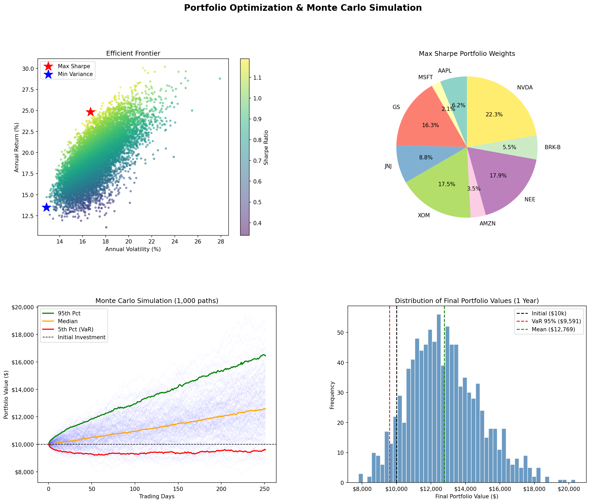

# Monte-Carlo-portfolio-optimization
**Tools:** Python · NumPy · Pandas · Matplotlib · yfinance  
**Topics:** Modern Portfolio Theory · Efficient Frontier · Value at Risk · Monte Carlo Simulation
This project builds a quantitiative equity portfolio optimizer from scarth using the Modern Portfolio Theory - MPT
The project is built to do the following
1. It pulls 5 years of real market data
2. Simulates 10,0000 random portfolio weight combinations to map the Efficient Frontier, 
3. Identifies the optimal risk adjusted portfolio 
4. Stress -tests said portfolio using a 1,0000 path Monte Carlo simulation to model the distribution of future returns


| Metric | Value |
|--------|-------|
| Optimal Portfolio Expected Return | ~25% annualized |
| Optimal Portfolio Volatility | ~15% annualized |
| Sharpe Ratio (Max) | ~1.1 |
| Monte Carlo Mean Outcome (1yr, $10k) | $12,746 |
| Value at Risk — 95% confidence | $9,573 (max loss: $427) |
| Value at Risk — 99% confidence | ~$8,900 |

---

## Stock Universe
10 equities across 6 sectors, selected to test diversification benefits:

| Ticker | Company | Sector |
|--------|---------|--------|
| AAPL | Apple | Technology |
| MSFT | Microsoft | Technology |
| GS | Goldman Sachs | Financials |
| JNJ | Johnson & Johnson | Healthcare |
| XOM | ExxonMobil | Energy |
| PG | Procter & Gamble | Consumer Staples |
| AMZN | Amazon | Consumer Discretionary |
| NEE | NextEra Energy | Utilities |
| BRK-B | Berkshire Hathaway | Financials |
| NVDA | NVIDIA | Technology |

---

## Methodology

### 1. Data Collection
- 5 years of adjusted daily closing prices pulled via `yfinance`
- Adjusted prices account for stock splits and dividends

### 2. Returns & Risk Calculation
- Daily log returns calculated via `.pct_change()`
- Annualized return = daily mean × 252 trading days
- Annualized volatility = daily std × √252
- Covariance matrix built across all 10 securities

### 3. Efficient Frontier (10,000 Simulations)
- 10,000 random portfolio weight combinations generated
- For each: computed expected return, volatility, and Sharpe Ratio
- **Sharpe Ratio** = (Portfolio Return − Risk-Free Rate) / Volatility
- Risk-free rate set at 5% (approximate 3-month T-bill rate, 2024)
- Identified two optimal portfolios:
  - **Max Sharpe Ratio** — best return per unit of risk taken
  - **Minimum Variance** — lowest achievable portfolio risk

### 4. Optimal Portfolio Weights (Max Sharpe)
| Ticker | Weight |
|--------|--------|
| NVDA | 22.3% |
| NEE | 17.9% |
| AMZN | 17.5% |
| GS | 16.3% |
| JNJ | 8.8% |
| BRK-B | 5.5% |
| XOM | 3.5% |
| PG | 2.1% |
| AAPL | 6.2% |
| MSFT | ~0% |

### 5. Monte Carlo Simulation (1,000 Paths, 1-Year Horizon)
- Applied **Geometric Brownian Motion (GBM)** to model daily price paths
- Each path draws random daily shocks from a normal distribution
- Formula: `r(t) = μ + σ × Z` where Z ~ N(0,1)
- Starting investment: $10,000

### 6. Value at Risk (VaR)
- **VaR (95%):** 5% chance the portfolio falls below $9,573
- **VaR (99%):** 1% chance the portfolio falls below ~$8,900
- Interpretation: in the worst 5% of scenarios, the maximum loss is ~$427 on a $10,000 investment

---

## Output Charts



**Chart 1 — Efficient Frontier:** Each point is a simulated portfolio. Color encodes Sharpe Ratio (yellow = highest). Red star = Max Sharpe portfolio. Blue star = Minimum Variance portfolio.

**Chart 2 — Portfolio Weights:** Pie chart of optimal capital allocation across the 10 securities.

**Chart 3 — Monte Carlo Paths:** 1,000 simulated portfolio value trajectories over 252 trading days, with 5th/50th/95th percentile bands overlaid.

**Chart 4 — Return Distribution:** Histogram of final portfolio values across all 1,000 simulations, with VaR and mean marked.

---

## How to Run

**1. Install dependencies**
```bash
pip install yfinance numpy pandas matplotlib scipy
```

**2. Run the script**
```bash
python3 portfolio_optimization.py
```

**3. Outputs generated**
- `portfolio_results.png` — 4-panel chart
- `efficient_frontier_data.csv` — all 10,000 simulated portfolios
- `portfolio_weights.csv` — optimal portfolio allocations

---

## Skills Demonstrated
- Python (NumPy, Pandas, Matplotlib, yfinance)
- Quantitative finance: MPT, Sharpe Ratio, VaR, GBM
- Statistical simulation and probability distributions
- Data visualization and financial storytelling
- Working with real market data from public APIs

---

## Limitations & Future Work
- Model assumes normally distributed returns (real returns have fat tails)
- No short-selling or position size constraints applied
- Future improvements: add mean-CVaR optimization, factor model integration, or a Streamlit dashboard for interactive use

---

*Built as part of a finance & data science project portfolio. Data sourced from Yahoo Finance via yfinance.*
